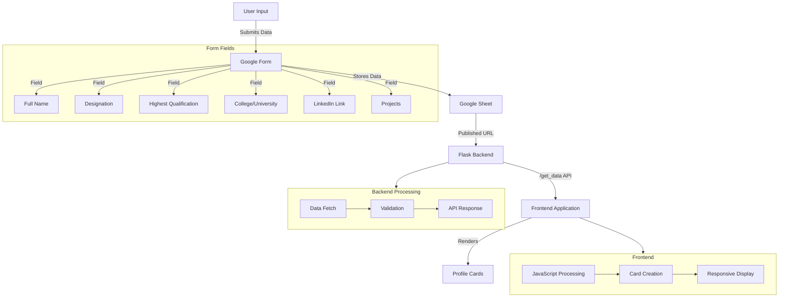

# Profile Display Application

A web application that displays professional profiles in a dynamic card layout, pulling data from a Google Sheet source.

## Features
- Dynamic profile cards displaying professional information
- Real-time data fetching from Google Sheets
- Responsive web interface with modern UI design
- CORS enabled for cross-origin requests
- Secure data handling with error management

## Data Fields
Each profile includes:
- Full Name
- Designation
- Highest Qualification
- College / University Name
- LinkedIn Profile Link
- Projects

## Technology Stack
- Frontend: HTML, CSS, JavaScript
- Backend: Flask (Python)
- Data Source: Google Sheets
- Deployment Ready: Gunicorn server support

## Project Structure
```
profile/
├── server/
│   ├── .venv/               # Python virtual environment
│   ├── main.py             # Flask application server
│   ├── requirements.txt    # Python dependencies
│   ├── scripts.js          # Frontend JavaScript
│   └── README.md          # Server setup instructions
├── index.html             # Main application page
├── styles.css            # Application styling
└── README.md            # Project documentation
```

## Application Flow Diagram



## Dependencies
### Backend (Python)
- Flask==2.3.3
- Werkzeug==2.3.7
- Pandas==2.0.3
- NumPy==1.24.3
- Requests==2.31.0
- Flask-CORS==4.0.0
- Gunicorn==21.2.0

### Frontend
- HTML5
- CSS3
- Modern JavaScript (ES6+)

## Setup Instructions
1. Clone the repository
2. Navigate to the `server` directory
3. Create and activate a Python virtual environment:
   ```bash
   python -m venv .venv
   source .venv/bin/activate  # On Windows: .venv\Scripts\activate
   ```
4. Install dependencies:
   ```bash
   pip install -r requirements.txt
   ```
5. Start the Flask server:
   ```bash
   python main.py
   ```
6. Access the application at `http://localhost:5000`

## Data Source
The application uses the following Google Sheet as its data source:
[Google Sheet Link](https://docs.google.com/spreadsheets/d/e/2PACX-1vRPxcIRHbPsXXTXNB8lR9CU1edyXTgyT3pTuj6pnhcqkeTMeByPBeufVZmFk7A_ynXeK6wnimziWVNP/pub)

## Production Deployment
The application is configured for production deployment with:
- Gunicorn WSGI server
- CORS enabled for cross-origin requests
- Environment-based debug mode
- Configurable port settings

For detailed server setup and configuration, please refer to the `server/README.md` file.