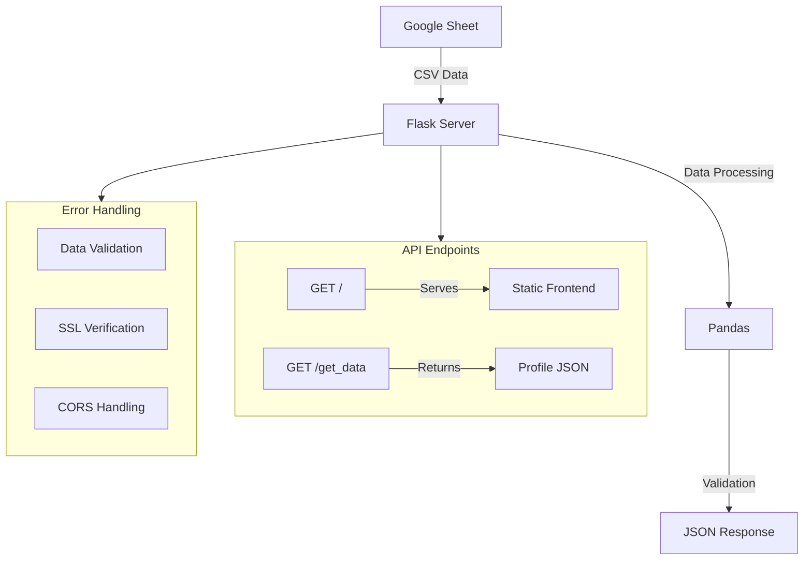

# Profile Server

A Flask-based server application that fetches and serves profile data from a Google Spreadsheet.

## Features

- RESTful API endpoint for profile data retrieval
- Real-time data fetching from Google Sheets
- Pandas-based data processing and validation
- CORS enabled for cross-origin requests
- Error handling and data validation
- Serves static frontend files

## Data Structure

The server handles the following profile fields:
- Full Name
- Designation
- Highest Qualification
- College / University Name
- LinkedIn Link
- Projects

## Server Architecture



## Setup Instructions

1. Create a virtual environment:
   ```bash
   python -m venv .venv
   source .venv/bin/activate  # On Windows: .venv\Scripts\activate
   ```

2. Install dependencies:
   ```bash
   pip install -r requirements.txt
   ```

## Project Structure

```
server/
├── main.py              # Flask server implementation
├── requirements.txt     # Python dependencies
└── README.md           # Server documentation
```

## API Endpoints

### GET /
- Purpose: Serves the main HTML page
- Response: HTML template for profile cards
- Location: Served from parent directory

### GET /get_data
- Purpose: Retrieves profile data
- Response Format: JSON array of profiles
- Fields:
  ```json
  [
    {
      "Full Name": "string",
      "Designation": "string",
      "Highest Qualification": "string",
      "College / University Name": "string",
      "LinkedIn link": "string",
      "Projects": "string"
    }
  ]
  ```

## Dependencies

All dependencies are specified in requirements.txt:
- Flask==2.3.3
- Werkzeug==2.3.7
- Pandas==2.0.3
- NumPy==1.24.3
- Requests==2.31.0
- Flask-CORS==4.0.0
- Gunicorn==21.2.0

## Running the Server

Development:
```bash
python main.py
```
The server will start on `http://localhost:5000`

Production:
```bash
gunicorn main:app
```

## Data Source

The application fetches data from this published Google Sheet:
[Google Sheet Link](https://docs.google.com/spreadsheets/d/e/2PACX-1vRPxcIRHbPsXXTXNB8lR9CU1edyXTgyT3pTuj6pnhcqkeTMeByPBeufVZmFk7A_ynXeK6wnimziWVNP/pub)

## Technical Notes

- SSL verification is disabled for Google Sheets access
- CORS is enabled for all origins to support various deployment scenarios
- Static files are served from the parent directory
- Environment-based debug mode configuration
- Gunicorn WSGI server support for production deployment
- Error handling for missing or invalid data
- Automatic data type validation using Pandas